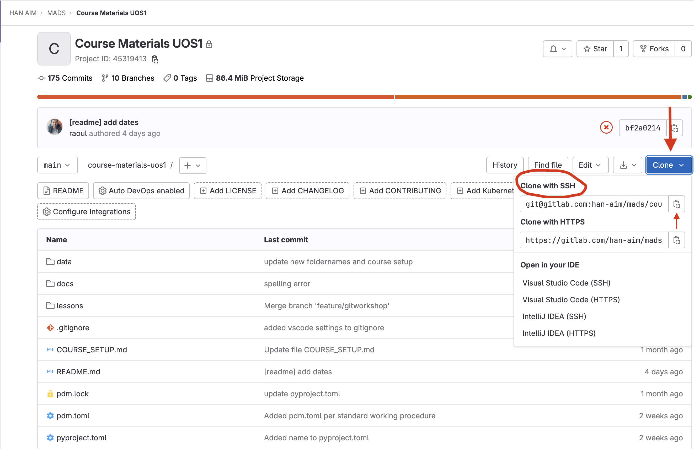

## Requirements & Recommendations (Part 1)

Below is a list of requirements and recommendations on software tools for this course. Please make sure you have all the requirements installed and working before next class.

> **NOTE**: Recommendations are not mandatory, but if not adopted, it is on your own responsibility. Any technical problems you might encounter with your code and/or project management, will not be supported in class.

If you have any questions or problems with the any of the points below, please contact us as soon as possible.

> **NOTE:** Guides and tutorials for installation are linked in the headers.

1. **[`Install WSL`](https://learn.microsoft.com/en-us/windows/wsl/install)**\
   If you are a windows user, you should have installed WSL2 already following the pdf on Onderwijs Online. In the header there is also an online tutorial linked on how to install WSL2.

   > **NOTE: For Windows Users Only**. <U>We do not support Windows in class (only Linux and Macos).</u> We recommend that Windows users install WSL2.

   If you are not able to install WSL2, please contact us as soon as possible.

1. **[`Create a GitLab account with your HAN email address`](https://gitlab.com/users/sign_up)**\
   During this course we will use Git and Gitlab to distribute the course materials and collaborate. <u>It is mandatory to have a GitLab account with a han email address.</u>

   Use the link in the header to create a gitlab account with your HAN email address. If you are not able to create a gitlab account, please contact us as soon as possible.

   > **NOTE:** If you already have a GitLab account, please create a new account with your HAN email address. This is necessary so we can add you to the course materials repository.

1. **`Generate a SSH key and add it to your GitLab account`**.\
   We will be using SSH to connect to GitLab. Go to the PDF `01_setting_up_ssh` in Onderwijs Online and follow the instructions to generate a SSH key and add it to your GitLab account.

   If you are not able to generate a SSH key and add it to your GitLab account, please contact us as soon as possible.

1. **[`Install Git`](https://git-scm.com/downloads)**\
   We will be using git to distribute the course materials and collaborate. Use the link in the header to install Git on your system. <u> Having git installed is mandatory and necessary to follow this course.</u>

   If you are not able to install git, please contact us as soon as possible.

## Step by step guide to clone the course materials repository for UOS 1

This guide assumes that:

- you are working on a Unix based operating system (MacOs or a Linux distro),
- have [Git installed](https://git-scm.com/downloads),
- created a [GitLab account](https://gitlab.com/users/sign_up) with your HAN email address,
- generated a SSH-key and added the public key to your GitLab account.

> **NOTE:** If you are working on Windows, please follow the instructions to install WSL2 in the PDF tutorial `wsl2.pdf` on Onderwijs Online and continue with the guide in the WSL2 terminal.

1. Go to the [course-materials-UOS1 repository](https://gitlab.com/han-aim/mads/course-materials-uos1) and copy the SSH clone URL:

   

1. Create a directory where you want to clone the course materials repository. For example, you can create a directory called MADS in your home directory.

1. Open a terminal in this directory to clone the course-materials-UOS1 repository.

1. Clone the course-materials-UOS1 repository by running the following command in your terminal:

   ```bash
   git clone git@gitlab.com:han-aim/mads/course-materials-uos1.git
   ```

1. To continue the setup go to the directory `/lessons/02_setup` in the course-materials-uos1 repository on your local machine and continue with `00_overview.md` document.
