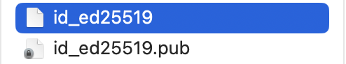

# Setup SSH

#### **What is a ssh-key?**

[Shh is a an encryption method](https://www.ssh.com/academy), that allows for secure access. Recent operating systems come with ssh pre-installed\[^1\].
You can check with `which ssh` if you have the command tools.

#### **Generate a ssh-key**

To generate a ssh-keygen:

1. open the terminal
1. use the following command:

```
ssh-keygen -t ed25519 -C "your_email@example.com"
```

Accept all defaults. You are being asked for a password, but it is okay if you dont set one.

The command will generate a two files in the ~/.ssh directory:



You can check this by running `ls ~/.ssh` in the terminal. You should see two files: `id_ed25519` and `id_ed25519.pub`. The first one is your private key, the second one is your public key. The private key should never be shared with anyone, the public key can be shared with anyone.

#### **Add ssh-key to Gitlab account**

To be able to access the MADS-UOS1 repository, Gitlab needs to know your public key. Follow these [instructions to add your ssh-key to your Gitlab account](https://docs.gitlab.com/ee/user/ssh.html#add-an-ssh-key-to-your-gitlab-account)

\[^1\]: In the unlikely case if you don't have ssh, follow these [instructions for MacOs](https://osxdaily.com/2022/07/08/turn-on-ssh-mac/) and these [instructions for Ubuntu linux](https://ubuntu.com/server/docs/service-openssh).
